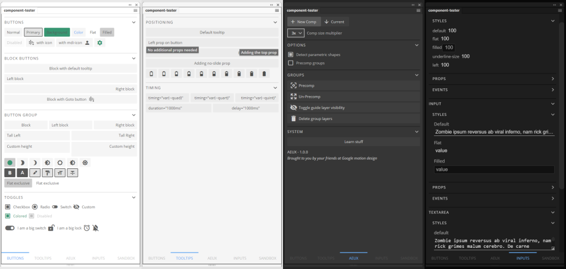
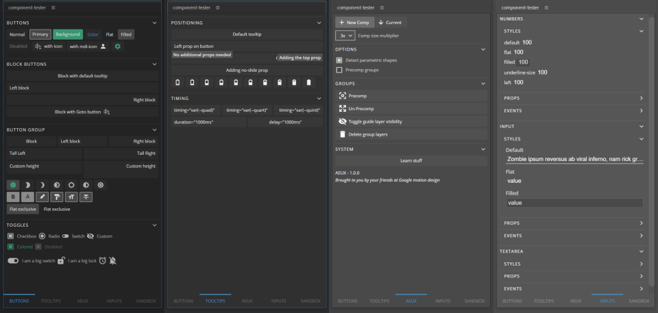

# <a href="https://www.battleaxe.co/"></a> brutalism

| [Demos](#demos) | [Installation](#installation) | [Getting Started](#getting-started) | [Templates](#templates) | [Components](#components) |
| --------------- | :---------------------------: | :---------------------------------: | :---------------------: | :-----------------------: |


## [Battleaxe](https://www.battleaxe.co/)'s component library for every app, every theme, and every one





## [Check out the documentation site](https://battleaxe.dev/brutalism-docs/)

Make panels for After Effects, Illustrator, Photoshop, InDesign, Premiere Pro, Audition, Animate, InCopy, Prelude, Dreamweaver, Muse, Bridge and Rush like a pro even if you can't code like one.

Developing a panel for Adobe should be more about what your tool does, not just what your tool looks like. Brutalism is so quick you can make a panel in a few hours instead of a few months, and so flexible you can rely entirely on what it offers or take only the parts you need:

- Blazing fast developer workflow with [bombino](https://github.com/Inventsable/bombino) lets you go from creating a panel to signing it as a ZXP in less than a minute.
- Clean Battleaxe design built with Adobe in mind first, but still functional in browser and even mobile. Brutalism is the only design framework meant for Adobe programs and not needing to bend over backwards just to have them look out of place in the host app.
- Components are designed to simplify your project and keep your logic clean, allowing you to create entire panels in a single page with less than 30 lines of HTML (AEUX demo is only 23!) and hardly any JS.
- Host app themes, scrollbars, UI changes, and colors take care of themselves. You have access to over 40 colors specific to the current host and theme and you're free to let your own components and HTML blend in by using the corresponding CSS variables made available.
- Script loading is dead simple and dynamic. You can easily use any number of scripts via the root `<Panel>` component's `script-path` and `utils` props, and you can keep them anywhere you want.
- Context and flyout menus are handled via props in a `<Menus>` component; completely reactive, dynamic, and in standard JS -- not some ludicrous XML.
- Typescript support for scripting is built in for supported apps, allowing you to see the application's DOM as you type code even if you have no idea how to use Typescript -- no need for dinosaur programs like ESTK or it's Object Model Viewer here.

- Nearly all the hurdles and quirks of working with Adobe using with Vue, Webpack, and NodeJS taken care of for you and much more!

---

## Demos

### These are not screenshots, they're the real thing in browser:

- [API panel](https://brutalism.netlify.app/#/)
- [Bombino Basic](https://brutalism.netlify.app/#/basic)
- [Bombino Router](https://brutalism.netlify.app/#/router)
- [Bombino Vuex](https://brutalism.netlify.app/#/vuex)
- [AEUX](https://hungry-goldstine-0c6a71.netlify.com/#/) - [Homepage](https://aeux.io)

All of the above are made possible by this library's `<Panelify>` component and dead simple to do.

---

## Installation

```bash
npm i brutalism
```

If using [bombino](https://github.com/Inventsable/bombino):

```bash
npm i -g bombino

# In any valid CEP directory:
bombino

# > Select a Brutalism template on prompt

# Skip above installation and invocation with a single command:
# npx bombino
```

---

## Getting Started

#### Bombino takes care of all this for you. Only do the below if installing the library manually.

### Within `./src/main.js` (to use anywhere in project with no need to import per component file):

```js
// Import the desired components
import { Panel, Menus } from "brutalism";

// Assign them as global components to the Vue instance
Vue.component("Panel", Panel);
Vue.component("Menus", Menus);

// Be sure to do so before instantiating Vue:
new Vue({
  router,
  render: (h) => h(App),
}).$mount("#app");
```

- [Kitchen sink](./examples/KitchenSink.js) (all components, no utility functions)
- [Utilities only](./examples/Utilities.js)

### Within `App.vue` or a given .vue file:

```html
<script>
// Import as many or few components as you need
import { Panel, Menus } from 'brutalism';

export default {
  components: {
    Panel,
    Menus
  }
}
```

---

## Templates

Quickstart templates with [bombino](https://github.com/Inventsable/bombino) to get you up and running in less than a minute:

- [Brutalism Basic](https://github.com/battleaxedotco/bombino-brutalism-basic)
- [Brutalism Router](https://github.com/battleaxedotco/bombino-brutalism-router)
- [Brutalism Vuex](https://github.com/battleaxedotco/bombino-brutalism-vuex)

---

## Components

[See all available components live on the documentation site here](https://battleaxe.dev/brutalism-docs/)
